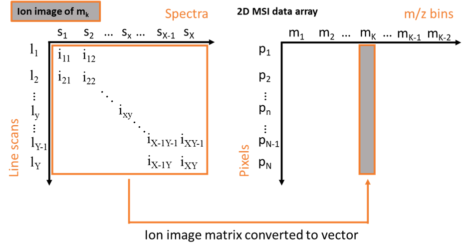
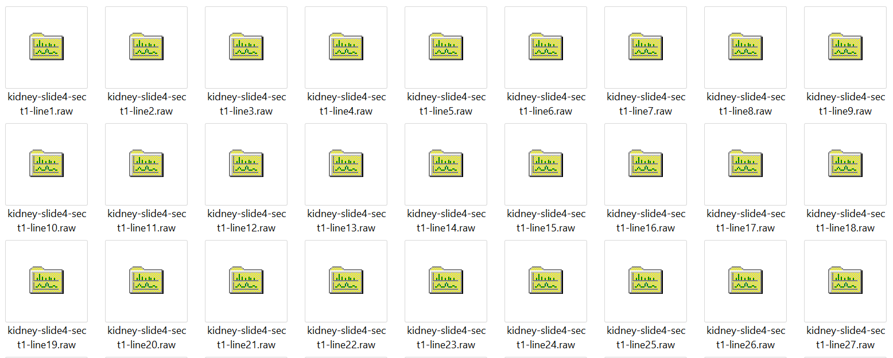
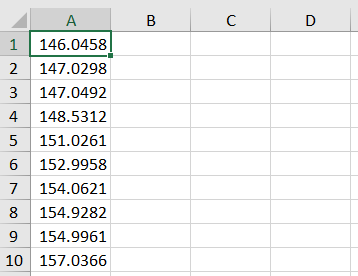

# RAW-MSI-generator
It is a mass spectrometry imaging (MSI) data processing pipeline to generate ion images from Thermo .raw and Agilent .d files. It is designed for line-by-line data acquisition manner exclusively.

This pipeline extracts ion images from raw files. MS API reads raw files for twice. It firstly checks the dimensionality of the MSI data sets, second it extracts peak intensities with a mass list and a mass window. During the second step, it also aligns line scans by interpolation with respect to spectrum timestamp. Finally, the aligned intensities are organized into a stack of ion images. The first entry in the stack is TIC.

External libraries and helper functions are within .py files. The main program is in the notebook file with 3 examples: Thermo .raw files, Thermo .raw selected ion monitoring (SIM) files and Agilent .d files. However, the source data are not included in this depository. Several data processes have already been implemented in the notebook, such as peak extraction, pixel alignment, TIC normalization and spike removal visualization.

## Requirements 
numpy 1.18.1 
pandas 1.1.0 
matplotlib 3.1.3 
pymsfilereader 1.0.1 (Please follow this package’s instruction on github for installation)
multiplierz    2.2.0 (Please follow this package’s instruction on github for installation)
tqdm 4.44.1

## How to use 
### Input Data preparation
1. .raw/.d files:
.raw/.d files are named with numbers with respect to the acquisition sequence. The general format is “XXX_number”. Please keep description “XXX” constant throughout the data set. For example: 

2. mass list:
An excel file with only mass values in one column. For example:

### Main programs
Edit and run main.ipynb cells. 
